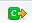

```{r setup, include=FALSE}
knitr::opts_chunk$set(echo = TRUE)
```

This lab is expected to be self-paced and make sure that everyone is familiar with R and RStudio. This is a *long* lab, but we expect that for everyone, parts of this will be review and parts will be new. All of these concepts will continue to be reinforced in future labs.

In particular, for Data 8 students, working in R and R Studio will be new. For those students, who are more familiar with python, there are special notes about how R commands compare to python commands (if you're coming from STAT 20, you can ignore these comments). You will find that the basic concepts from python will transfer over, and you just need to concentrate on figuring out the difference in syntax.

For Stat 20 students this will feel very familiar, but some of the programming concepts, like how to write your own function and for-loops will be new. (Data 8 students will be familiar with these concepts, but should focus on the syntax in R). Please *slowly* go over these sections and if you are not clear ask for help in lab or do some outside google searches to find further tutorials on these concepts. 

While we give "Exercises", nothing needs to be turned in -- they are just for checking your understanding. Go at your own pace, and only do the exercises if they add to your understanding. 

# Getting RStudio

RStudio is an open-source Integrated Development Environment (IDE) which provides many user-friendly features. We will use RStudio throughout the rest of the course. RStudio can be started from the desktop (i.e. your computer) or through logging into a website and accessing a web server. The user interface is generally the same for the two. 

We will use the web version for labs, since this makes it easier and quicker to get going during labs. Moreover, by clicking on the links we provide you, it will also upload necessary additional files for the lab into your workspace. 

We give brief instructions below for both methods, but for following this lab (and future labs), you should use the web version. 

## Web Version

A RStudio server can be accessed via a web browser for this class. All the data storage and computation are done remotely on the server (similar to what you may have experienced in Data 8 or Stat 20). 

### Log In

To login in to the server, open the url for this lab (*Coming Soon!*). Once successfully authenticated, you will see the following RStudio interface. 


The links we give you for lab also upload files necessary for completion of the lab (e.g. data files, code files, etc.). 

## Desktop Version

The layout looks similar to that of the web version.  The installation of R and RStudio is straightforward, just as installing other applications in your computer. We strongly recommend for your own convenience that if you have your own computer, download and install R and do assignments other than the lab on your own machine. 

- To install R on your computer (legally for free!), go to the home website of R [https://cran.r-project.org/](https://cran.r-project.org/) and choose the platform (Mac, Windows or Linux) corresponds to your own divice.
- After successfully installing R, you can [https://www.rstudio.com/products/rstudio/download3/](https://www.rstudio.com/products/rstudio/download3/) according to your platform. 

# Introduction to RStudio

## Your first command in the console

The main window is the "Console" on left panel. The symbol > is a command prompt. And this is where R evaluate your commands. For example, type the following commands in the console:

```{r, results="hide"}
a = 1:5
a
```

You should see something like this:


R print the outputs (except figures) in the console, right below your commands. You might notice that after you excute the command, vector `a` appears in the upper right `environment` window. In fact, you can always check all the value of objects you created in the `environment` window. Now you may try to explore how to execute commands in the console yourself.

## Create an Rscript to store your commands.

R allows you to go back to previous commands using up and down arrow in your keyboard. However, often times you would like to store R commands in a file. To do so, you can create an R Script by clicking `File` -> `New File` -> `R Script` with the menu bar in the top. R will create an R script with the file extention `.R` and the **editor** window will be invoked. R scripts is a file type that stores only R commands and comments. 

Type the same commands from above into the R script.


To run one line or several line of code in an R script, put your cursor in that line or select mulitple lines, and then click the `Run` botton.


## RStudio Layout

The RStudio interface contains several component:

#### Console window (bottom left)

 This is where you can type simple command after the the prompt ">". R will excute your current command and return the output in this window. 

#### Editor window (top left)

This window will contain the files you are working on, and is hidden on initial startup. This will show you files that you have opened or created. You will want to have separate files where you will save commands for editing and future use.

If you do not have any files open, this editor may not show up (like when you first opened RStudio). You can make this window appear by creating a new document (e.g. with the menu bar in the top `File` -> `New File` -> `R Script`.) or opening a file ( `File` -> `Open file ...`). The editor supports multiple file type, including R script, R markdown, R notebooks, and Sweave files. 

For example, open the R script  `example.R` in the lab 0 folder and try to run the code (you don't have to understand the code). You can run the code by either cutting and pasting into the console, or highlighting the code and clicking `Run` button. 

Try adding the following code to the `example.R` file and running it:

```{r, eval=FALSE}
D<-data.frame(a=1:3, b=2:4)
```

You can also run all the code in the file by clicking on the `source` button.

The red font with `*` at the end of the file name shows that the current changes are not saved. While you are working in a file, you should save it frequently to avoid losing data unexpectedly. 


#### Environment / history window (Top right). 

In the environment window you can see the data, values and functions you created or loaded. You can view the data by clicking on them. In the example below, if you click the data frame `D` you created, you can see the data on the editor window. The history window shows the commands which has been excuted.


#### files/plots/packages/help tabs (Bottom right)
+ **files**: By double clicking the file name, you can open files, then view and edit them in the editor. You can upload files from your own device to the server by clicking the `Upload` botton. To download files from server, check the box before that file and go to `More` -> `Export`. This is useful, for example, if you are working on the web server, and then want to move your files to your own computer and work on your desktop version of R.
+ **plot**: The plots tab will display the graphs. It allows you to go back to pervious plots (by clicking on the left-arrow icon) and export plot as image or pdf. If you highlight the following code and click `Run` you should see a histogram come up in this tab.

```{r}
C=rnorm(1000)
hist(C)
```

+ **packages**: install and load packages.
+ **help**: search and view the help document. 

## Working Directory

Your working directory is the folder on your computer in which you are currently working. When you ask R to open a certain file, it will look in the working directory for this file, and when you tell R to save a data file or figure, it will save it in the working directory. 

Before you start working, please set your working directory to where all your data and script files are or should be stored. You can browse and choose working directory by going to `Session` -> `Set working directory` -> `Choose directory ...` as follows.


## Packages


R can do many statistical and data analyses. They are organized in packages. 

To get a list of all installed packages, go to the packages window or type `library()` in the console window. If the box in front of the package name is ticked, the package is loaded (activated) and can be used. 

- *To install a package to your computer* For example, if we want to install a package named `ggplot2`,  click install packages in the packages window and type ggplot to search and install. Or you can type `install.packages("ggplot2")` in the console. 
- *To load a package for use* To use a installed package, you have to load it to you current working environment. You can check box in front of geometry or type `library("geometry")` in the command window.

> **_Python Users:_** In python you would bring in modules with the command `import` to bring in other code; packages or libraries are the equivalent idea in R, and the command `library` is like that of `import`. In python, you can also use `import` to bring in arbitrary code that you have created that is saved in a script file (e.g. functions you have written and saved in a `.py` file). In R the `library` command is *only* for bringing in bundled packages, meaning code that has been developed and distributed in a particular format and has been installed into your R. To read in arbitrary code in a script `.R` file you would use the function `source`. 


# Introduction to R Markdown

While R Scripts contains only R code, R Markdown enable us to create dynamic documents with embedded chunks of R code. The document can be converted to other formats such as HTML and PDF to have a "published" version. So you can develop a published report with the code embedded, ensuring that you can always recreate your work (as opposed, for example, to cutting and pasting figures or results into a text editor like Word). 

> **_Python Users:_**  The relationship between R Scripts (`*.R`) and R Markdown (`*.Rmd`) is similar to the relationship between Python scripts (`*.py`) and IPython Notebooks (`*.ipynb`). 

To create an R Markdown file, click on `File` -> `New File` -> `R Markdown`. You should now see a dialog as shown below. Select ‘Document’ in the left panel and fill in title and author field and hit ‘OK’.


You should now have a document which looks like this:


RStudio has already populated the file with example text and code to get you started (which you would obviously delete for a real assignment). The code is contained in "chunks", which start with ` ```{r} ` and end with ` ``` `  (each on their own line):


Extra options can be added in the ` ```{r} `. This code chunk has been given a descriptive name ("cars"), via ` ```{r cars} ` 

To add new code chunks into the document, click in the document where you want the code chunk to go and click add chunk icon . Try to add a code chunk after the "cars" chunk that is already there. It should look like this


Add the following code into your chunk, 

```{r, eval=FALSE}
a=c(pi, 2, 4)
b=1:3
a>b
```

so that it looks like this


## Running code

If you click on the `run` icon at the top right of the chunk (triangle in chunk), the entire chunk will be run and the output will either show the results below


or will show them in the console which look like this:


> **_Python Users:_** Beneath the code is similar to how IPython notebooks work

You can change between these two options under the "gear" button):


Similar as in R script file, you can instead run one or several lines of code from the R Markdown. To run several lines of code, You may select a piece of code as follows:


Click `Run` and get a drop-down menu about what you want to run (there are simple key short-cuts that will show up there, but they differ on different operating systems). 

## Publishing (compiling) your document

To generate an HTML file, click on the icon . 

It should generate the HTML in the same folder as the R Markdown file.

The above code chunk will look as follows in the HTML file: 


This will run all the commands from the beginning in a fresh environment. You will often discover mistakes when you do this, even if you think you have been testing your code interactively the whole time. Running everything fresh ensures that you have *reproducible* code. 

For example, suppose your code ran fine, you changed something, but didn't hit run. Or if you move a chunk around and don't realize that you moved it *after* another chunk that depends on the results of that chunk -- if you run the chunks in the right order, you won't get an error. But when you compile it, it won't work. 

You should always give yourself time to test your assignment before the due date, and as you finish one section/question, compile the results and see if you get what you expect rather than waiting until everything is finished.

Please refer to an introduction of [Markdown Basics](http://rmarkdown.rstudio.com/authoring_basics.html) on how to add headers, lists and images on the markdown file and generally formatting your text.  


## R Notebooks (optional)

You also have an option to create a R notebook. R notebooks create a R markdown file on your computer so they're not so different, but R Studio treats them a little bit differently. 

Create a new R Notebook (under File/New... again). It should create a file that again is populated with example code. Go to the first chunk (`plot(cars)`) and hit the Run triangle for that chunk. You should see the plot appear under the code:


When you when save this notebook, it will save both the `.Rmd` file and also a html file with extension `.nb.html`. 

You can see this file by going to the "Preview" button at the top (which will force you to save the file)


In the Viewer tab, you should see a html come up with the results. You can see the code and plot below, and this html has the option to hide your code.


This html file is not like the html file from our simple R markdown from before. Before, with a simple R markdown, when we "knit" our `.Rmd` file, it reran all of our code *from scratch* and created a html of the output. This means that all the code has to be able to run in sequence correctly.

With the `.nb.html` that is created, it is just a html file that mimics what actually have on your screen, namely the output of the chunk when it was last run by you in your editor is displayed.

Add the following code to your R notebook below the plot code **but don't run it**

```{r, eval=FALSE}
a=1:3
a<1
```

If you hit the preview button, you can scroll down and see this new code, but the actual results will not show:


If you do run the code and hit preview, you'll see the results now show up:


This can be convenient to be able to see (and save) exactly where you are in terms of what you have tested and run. It is also much quicker than compiling the whole document, if you just want to quickly see how the html (i.e. text) will look at the end. It also allows a preview, even if part of your code isn't finished.

**Warning** But it also means that you could have broken code that you haven't run and this preview will not let you know that. 

So while this preview can be handy, you still need to be able to compile it completely from scratch to know that everything works. The preview button has a drop down menu that gives you the option to do this (i.e. compile them like standard `.Rmd` documents)


By clicking "Knit to html" (or pdf) you can make sure the entire thing compiles fresh from the beginning (which is what we will do in testing that your code works).


# Introduction to R language

This document is compiled from a Rmarkdown, but is a little bit complicated as an introduction to Rmarkdown, because of the screenshots and python comments that we have added. 

In future labs, your labs will be Rmarkdown documents. You will open them up and interact with the code we have given you as part of the lab directly in the Rmarkdown file.  You will turn in your modified Rmarkdown, along with a compiled pdf version as your solution to gradescope. 

But for this lab (where you do not need to turn in anything), you will need to cut and paste (or type!) the commands from the html version of this lab into your console. 

## Assigning values
Here we do a simple assignment of a number to a variable called `val`:

```{r}
val <- 3
print(val)

Val <- 7 # case-sensitive!
print(Val)
print(val)
Val-val #you don't really need the print statement
```

Notice the assignment operator `<-`, which consists of the two characters `<` (“less than”) and `-` (“minus”), and must be strictly side-by-side and ‘point’ to the object receiving the value of the expression. R expression is case sensitive, which means A and a are different symbols and would refer to different variables.

The `=` operator can be used as an alternative (like in python). 

```{r}
val = 3
print(val)

Val = 7 # case-sensitive!
print(Val)
```

## Arithmetic Operators

Let's learn basic arithmetic operators

> **_Python Users:_** While in Python we import `math` or `numpy` packages to do calculations such as square root and log, in R these are built-in functionalities and can be applied directly. 

```{r}
# add numbers
2 + 3
# powers
3^4
# square root
sqrt(4^4)
# 21 mod 5
21 %% 5
# take log
log(10)
# exponential
exp(2)
# mathematical constant pi
2*pi
# absolute value
abs(-2)
# scientific notation
5000000000 * 1000
# scientific notation
5e9 * 1e3
```

> **_Python Users:_**  The following would be the corresponding code in python for these arithmetic operations:

```
import math
import numpy as np

print(2 + 3) # add numbers
print(3**4) # powers
print(pow(3, 4)) # powers
print(math.sqrt(4**4)) # functions
print(21 % 5) # 21 mod 5
print(math.log(10)) # take log
print(math.exp(2)) # exponential
print(np.abs(-2)) # absolute value
print(2*math.pi) # mathematical constant

# scientific notation
print(5000000000 * 1000)
print(5e9 * 1e3)
```

**Exercise 1.** You've seen the probability density function of Normal distribution $N(\mu, \sigma^2)$ in Data8/Stat 20 as follows:

$$p(x)=\frac{1}{\sqrt{2\sigma^2\pi}}\exp{-\frac{(x - \mu)^2}{2\sigma^2}}$$

Now let $\mu = 1$, $\sigma^2 = 2$, and calculate the value of the density function at $X = 0$. Finish the chunk below

```{r}
mu <- 1
sig.sq <- 2
x <- 0
# insert code here to calculate this value
```

You can check that you got the right answer by making sure that it is the same as the following (built-in) function in R that calculates this quantity:

```{r}
dnorm(0, mean=1, sd=sqrt(2))
```

## Data Types

R has similar data types as in python: numeric values, integer values, characters (i.e. strings), and logicals (i.e. booleans or  TRUE/FALSE). 

> **_Python Users:_**  In R the boolean value is `TRUE` or `FALSE` (all caps), while in Python it would be `True` or `False`

In R we can generally test what something is using functions like `is.X`

```{r}
is.numeric("my name is")
is.character("my name is")
is.numeric(5)
is.integer(5) #This is false! you have to specify values to be integers, other wise they are saved as numeric (i.e. decimal valued)
is.character(TRUE)
is.logical(TRUE)
```

## Relational operators and logical operators

Logical values generally arise from comparisons. Here we will review operators for comparing values in R. 

The basic numerical comparisons are `<`, `<=`, `>`, `>=`. To do put together multiple comparisons we can require both logical statements to be true (`&`) or at least one (`|`)

> **_Python Users:_**  In python, the equivalent of `&` is `and` and of `|` would be `or`, i.e. python uses the words for these operations.

```{r}
(1 > 0) & (3 <= 5)
(1 < 0) | (3 > 5)
(3 == 9/3) | (2 < 1) 
!(2 != 4/3)
```

> **_Python Users:_**  The above would be the corresponding code in python for these logical operations:

```
print((1 > 0) and (3 <= 5))
print((1 < 0) or (3 > 5))
print((3 == 9/3) or (2 < 1) )
print(not(2 != 4/3))
```

**Exercise 2** We want to use R and the function `dnorm` that evalutates the normal density to answer the following questions. Recall that `dnorm(x,mean=1,sd=2)` is the value of the normal density with mean 1 and standard deviation 2 evaluated at x. 

* The density of N(1,2) is larger than the density of N(0,2) at X=0. Assign your TRUE/FALSE answer to variables `result1`.
* The density of N(1,2) at X=0 is larger than 0.2 and less than 0.3. Assign your TRUE/FALSE answer to variables `result2`.

```{r}
mu1 <- 1
mu2 <- 0
sig.sq <- 2
x <- 0
# Add code 

# uncomment to print annswer
# print(result1)
```

```{r}
# Add code 

# uncomment to print annswer
# print(result2)
```

# Vectors

Vectors store a series of values that are of the same data type in R. 

There are several ways to create an vector in R.

You can enter in comma-separated values with the function `c`

```{r}
# set up a vector
a <- c(0.125, 4.75, -1.3)
a
```

> **_Python Users:_**  In python this would be equivalent to:

```
a = [0.125, 4.75, -1.3]
#Or a numpy array
a = np.array([0.125, 4.75, -1.3])
```

We can also use `c` to combine together existing vectors

```{r}
# set up another vector
b <- c(0, 1, -1, pi, exp(1))
b
newVector <- c(a, b)
newVector
```

> **_Python Users:_**  In python this would be equivalent to
```
a = [0.125, 4.75, -1.3]
b = [0, 1, -1, math.pi, math.e]
print([a, b])
print(np.concatenate((a,b)))
```

Vectors can also hold logical or character values

```{r}
bools <- c(TRUE, FALSE, TRUE)
bools
mystring <- c("Hello", ",", " ", "world", "!")
mystring
```

If we have a vector of strings, we can put them together into a single string (concatenate them) with the function `cat` or the function `paste` to have finer control of how we combine them (`cat` always puts a space between each value)

```{r}
cat(mystring)
paste(mystring,collapse="")##i.e. put nothing between the values
```


## Creating sequences with `seq`

The function `seq` generates sequences of numbers with a similar pattern. Usually it has three parameters: `from`, `to`, and `by`, which stands for the starting value, ending value and increment of the sequence.

```{r}
seq1 <- seq(from=4, to=9, by=1)
seq1
seq2 <- seq(1.1, 11.1, by = 2)
seq2
```

> **_Python Users:_**  Notice the difference with `np.arange`, where then end value given to `np.arrange` (given by `stop`) is one past the value you want:

```
>>> np.arange(start=4,stop=10,step=1)
 array([4, 5, 6, 7, 8, 9])
```

You can also write function `seq(from=a, to=b, by=1)` as `a:b`

```{r}
seq3 <- 1:6
seq3
```

*Getting Help* More parameters are available for `seq` -- how to figure out how to use them? R provides easy accessible documents to search for help for functions, datasets and packages. Before asking others for help, it will always be helpful to read the documents. Documentation for a function usually includes description, usages, arguments and examples. For example, there are two ways to access the document of the function seq: `?seq` and `help(seq)`.


**Exercise 3** To create a vector with replicates, we usually use `rep` as follows. Look at the documentation of `rep` and figure out what these arguments do

```{r, results="hide"}
seq4 <- rep(4, times=6)
```

```{r, results="hide"}
seq5 <- rep(1:2, times=5)
```

```{r, results="hide"}
seq6 <- rep(1:2, each = 5)
```

## Vectorized calculations

In R, mathematical operations on vectors are usually done element-wise, meaning the operation is done on each element of the vector.

Let $x=(x_1,x_2,\ldots,x_n$ and $y=(y_1,y_2,\ldots,y_n)$
Then `x*y` will return the vector
$$(x_1 y_1, x_2 y_2,\ldots,x_n y_n)$$

> For those that are familiar with vector operations this means that `x*y` for vectors in R is NOT the inner product, but element wise, and ditto for matrices. 

And it's similar for other operators. Look at how these mathematical operations work on vectors:

```{r}
vec1 <- 1:5
vec2 <- seq(0.1, 0.5, by = 0.1)
vec1 + vec2
vec2^vec1
vec1 > vec2
vec1 < 5 & vec2 > 0.3
vec1 < 5 | vec2 > 0.3
```

**Exercise 4**

Create the following vectors.

1. vec1: (20, 18,..., 2, 0)

```{r}
# Insert code here
```

2. vec2: $(2, \frac{2^2}{2}, \frac{2^3}{3}, \cdots, \frac{2^{10}}{10})$"

```{r}
# Insert code here
```

3. vec3: A True/False vector indicating which element in vec2 is larger than 10 and less than 50.

```{r}
# Insert code here
```

4. vec4: $(2, 4, 5, 2, 4, 5, \cdots, 2, 4, 5, 2)$, where there are 11 occurrences of 2 and 10 occurrences of 4 and 5.

```{r}
# Insert code here
```

5. vec5 = (1, 1,..., 1, 2, 2, ..., 2, ..., 10, 10, ..., 10) where there are 5 occurrences of each number from 1 to 10.

```{r}
# Insert code here
```


## Indexing and subsetting Vectors

> **_Python Users:_**  Python and R have similar subsetting options, but have small differences in indexing for which you should take care! Please read this carefully!

 Let's use a integer vector example to show the differences. 

1. You can retrieve elements based on their position in the vector, starting with the first element being 1

```{r}
vector1 <- 8:17
# the first element 
vector1[1]
vector1[10]
```

> **_Python Users:_**   R starts at 1 while Python starts at 0. In python you would say `vector1[0]` to get the first element and `vector1[9]` to get the 10th value of the vector

2. A negative index value means to remove that element

```{r}
vector1[-1]
```

> **_Python Users:_**  Python uses negative indexing differently. For example, `somevector[-1]` refers to the *last* element of the vector. However, negative index in R returns the vector with indicated elements DELETED. In python the R code above would be give the last element, not delete the first one:

```
>>> vector1[-1]
10
```

3. You can get a range of values using the `a:b` notation

```{r}
vector1[3:6]
```

> **_Python Users:_**  When subsettting an vector using `a:b`, R subsets b-a+1 (i.e. includes all of the elements a through b) elements while Python takes out b-a elements (includes elements a+1 through b). In python you would need to do `vector1[2:6]` to get these same values.


### Further subsetting

You can subset using non-consecutive integer vectors in the same way

```{r}
# pull out the 1st and 5th elements of the vector
vector1[c(1, 5)]
```
> **_Python Users:_**  In python you would do `vector1[[0, 4]]` to get these same values.

And using negative indices works the same way for vectors -- this example removes the 1st and 5th element

```{r}
# subsetting, noting (1, 5) here indicating the index instead of the values.\n",
vector1[-c(1, 5)]
```

You can also subset based on logical values as well, meaning if you have a logical vector *of the same length* as another vector, you can use it to subset to only the `TRUE` values of your vector.

```{r}
mylogical<-c(rep(TRUE, 3), rep(FALSE, 3), rep(TRUE, 4))
vector1[mylogical]
```

Since `vector1 > 5` creates a logical vector, I can use this to pull out entries of my vector greater than 5

```{r}
# indexing using boolean operators
vector1[vector1 > 5]
```


> **_Python Users:_**  In python you would do similar indexing, `vector1[vector1>5]` 


Alternatively, you can also find the indices of the vector that satisfy the logical using the `which` function. Here I find which of my vector values are even using `%%`

```{r}
whEven<-which(vector1 %%2 ==0)
print(whEven)
```

I can then index with this vector of indices

```{r}
vector1[whEven]
```

Note that I don't have to have unique indices -- I repeat the indices to get replicates of the values of the vector:

```{r}
vector1[c(3,3,2,1,4,2,2)]
```

The same indexing method works when assigning values, namely you can assign values to only a subset of the vector.

```{r}
vector1 <- 1:10
vector1[1] <- 5
vector1[3:6] <- c(8, 8, 8, 8)
vector1
```

You can also give names to each entry of your vector

```{r}
vector1<-1:3
names(vector1)<-c("A","B","C")
vector1
```

I can then subset the vector by a vector of characters giving the names I want

```{r}
vector1["A"]
vector1[c("B","C")]
```


## Some basic functions on vectors

1. Random sampling: We can sample with and without replacement with the function `sample`. We give the function a vector of values we want to sample from, the size of the sample we want, and whether we want to sample with or without replacement. We also use the argument `set.seed` so that in fact our random numbers will be the same every time we rerun this code, rather than varying.

```{r}
# Can put any arbitrary integer in set.seed and the random code that follows will always be the same:
set.seed(27489)
# random sample 10 number from integers 1 to 10.
x<-1:100
# WITH replacement
samples <- sample(x, size=500, replace = TRUE)
# WITHOUT replacement
sample.withoutrep <- sample(x, size=10)
```

2. The length of a vector

```{r}
length(samples)
```

3. Simple summary statistics of the data stored in a vector: `max`, `min`, `mean`, `median`, `var`, `sum`

```{r}
min(samples)
max(samples)
mean(samples)
median(samples)
var(samples)
sd(samples)
summary(samples)
```


# Factors

Factors in R are vectors especially for storing categorical variable. While factors can seem like they are vectors of character values, in fact they are treated very different by R. By storing the values in a factor we are telling R to treat the values as categorical values, not as arbitrary strings. The implicit assumption is that there are only small set of discrete values the vector take on (small relative to the size of the data). The possible values that a categorical variable takes on are called *levels* in statistics. 

It is very important for summarizing information and plot. Both numeric and character variables can be made into factors by the function `factor`. 

Here's an example where we take character-valued vectors and change them into a factor. 

```{r}
# Create character vector
vec2 <- c('Fri', 'Thur', 'Mon', 'Tue', 'Wed', 'Thur', 'Mon', 'Mon', 'Tue', 'Wed', 'Wed', 'Tue', 'Fri')
summary(vec2)
```

```{r}
# Create character vector
vec2.fac <- factor(vec2)
summary(vec2.fac)
```
Notice how R treats the variable differently now that it's a factor -- the function `summary` gives entirely different results for the factor vector as it does the character vector. 

We can also create factors from numeric vectors. This may not feel intuitive -- character values feel like they are naturally categorical. However, many times categorical variables might be encoded as numeric (e.g. 1=No, 2=Maybe, 3=Yes )

```{r}
# Create numeric variable
vec1 <- c(3, 2, 3, 2, 1, 3, 2, 3, 1, 1, 2)
vec1
summary(vec1)
```

Now convert it to a factor

```{r}
# Convert it to a factor
vec1.fac <- factor(vec1)
vec1.fac
summary(vec1.fac)
```
Again, notice how R treats the variable differently now that it's a factor. This is important, because it doesn't make sense to take the mean of categorical variables, even if they are encoded as numbers. 


I can also give more informative labels to my factor:

```{r}
# Convert it to a factor
vec1.fac <- factor(vec1, labels=c("No","Maybe","Yes"), levels=c(1,2,3))
vec1.fac
summary(vec1.fac)
```

We can check what the possible levels are and how many:

```{r}
# give the levels of the factor
levels(vec1.fac)
# give the number of levels of the factor
nlevels(vec1.fac)
```

To count the number of occurrence of each level, we use function `table`

```{r}
table(vec1.fac)
```

Note that you can also apply `table` to non-factor vectors, and that works -- the function transforms them to factors first, but without our nice mapping of the values to their labels that we created above.

```{r}
table(vec1)
table(vec2)
```

# Data frames


You can think data frame as a collection of vectors, each element of the vectors holding different types of data collected on the same observations. Data frames can be a mix of types of vectors (e.g. numbers and characters) and they are the main way to store data in R. Data frames can be manually created with the function `data.frame` as shown in the following examples. But usually, we would read them from an external file files, as we'll do later. 

> **_Python Users:_**  A Data frame in R is very similar to Table in Python. 

We will use examples of demonstrated in Data 8 below (LAB 3 and LAB 4)


When not specified, the function `data.frame` will coerce all character variables to factors, which is usually right for characters. If you want to keep the strings as character variables, you need to specify `stringsAsFactors = FALSE`.

```{r}
# Create a data frame from scratch (unusual)
imdb <- data.frame(Votes = c(1498733, 1027398, 692753),
        Rating = c(9.2, 9.2, 9.0),
        Title = c('The Shawshank Redemption (1994)', 'The Godfather (1972)', 
                  'The Godfather: Part II (1974)'),
        Year = c(1994, 1972, 1974),
        Decade = c(1990, 1970, 1970), stringsAsFactors = FALSE)
imdb
```

The `data.frame` is generally thought of like a matrix, where the vectors (the different variables or attributes) are stored as columns and the observations in the rows. 

```{r}
# Get number of rows (observations)
nrow(imdb)
# Get number of columns (attributes)
ncol(imdb)
```

You can index them like a matrix too:

```{r}
imdb[1:2,]
imdb[,c(3,5)]
```

But in fact they are *not* matrices, and they have some indexing options that don't work for matrices. In particular, you can call up a column using a `$` and the name of the column

```{r}
imdb$Title
```

All the tricks about indexing vectors will work for data frames (and matrices). For example, what do the following snippets do (in words)?

```{r}
imdb[imdb$Rating > 9.0 & imdb$Decade == 1990, ]
```

```{r}
oldest_rating <- max(imdb$Year)
imdb$Title[imdb$Year==oldest_rating]
```

# Plotting

We will go through a couple of basic plotting commands here. Specific types of plots have different commands, but most plotting commands share basic arguments for certain aspects of the plot, such as axis labels, titles, and so forth. Here are some important ones:

* `main`: Title of the plot
* `sub`: subtitle for plot (below x-axis)
* `xlab`/`ylab`: x/y axis label
* `xlim`/`ylim`: the limits (starting and ending values) for the x/y axis",
* `las` the orientation of the axis labels
* `lty` the type of line (e.g. `solid`, `dashed`, `dotted`)
* `lwd` the width of lines (>1 increases size, <1 decreases)
* `pch` the type of point (see help of `points` for the many options)
* `col` color of the plotted images (e.g. "red", "blue" -- `colors()` prints out all possible character names of colors you can give)
* `cex` the relative size of plotting (>1 increases size, <1 decreases) 

A full set of the parameters can be found in the help for `par` (`?par`).

Not all of these parameters are applicable for any plot, often because they don't make sense. 

Plotting commands in R are generally of two kinds, the main plotting command, that sets up the axes, labels, etc and draws the plot and then plotting commands that can add on top of the existing plot. 

Common main plotting commands are 

* `plot` -- for scatterplots (and plotting of other objects)
* `boxplot` -- boxplots
* `hist` -- histograms
* `barplot` -- barplots
* `curve` -- draw a function

Common commands for adding features to a plot are:

* `lines` -- drawing lines connecting points (input vectors x and y and draw lines between each (x[i],y[i]) and (x[i+1],y[i+1]), in the order they are listed in the vector)
* `points` -- drawing points (input vectors x and y and draw point for each (x[i],y[i]) pair)
* `legend` -- add legend to plot
* `abline` -- draw a line on a plot based on an equation for a line. Useful for horizontal and vertical plots, but can draw arbitrary intercept and slope too.
* `title` -- add x/y labels, titles, subtitles, etc on top of existing plot
* `axes` -- add axes (tick marks and their labels) to plot

We will go through three common examples, and you will see many more in future labs

## Histograms
 
The file `baby.csv` contains data on a random sample of 1,174 mothers and their newborn babies. The column ```birthwt``` contains the birth weight of the baby, in ounces; ```gest_days``` is the number of gestational days, that is, the number of days the baby was in the womb. There is also data on maternal age, maternal height, maternal pregnancy weight, and whether or not the mother was a smoker.

We will read this data in

```{r}
baby <- read.csv('baby.csv', header = TRUE)
head(baby)
```

The command `hist` is used to create histograms. 

```{r}
hist(baby$Birth.Weight, 
     col="darkblue", # histogram color,
     main = "Birth weights of babies",# plot title,
     xlab = "Birth weights (in ounces)", # x axis label,
     xlim = c(40, 180) # x axis range
     )
```

I can also add a vertical line showing where the mean and median are on this histogram using `abline` and the argument `v`, for "vertical" (notice that I have to repeat the `hist` command from above. This is because you can't spread plotting commands across R chunks in a rmarkdown. If I was typing into a console, I could just type in the `abline` command after my previous `hist` command)
 
 
```{r}
hist(baby$Birth.Weight, 
     col="darkblue", # histogram color,
     main = "Birth weights of babies",# plot title,
     xlab = "Birth weights (in ounces)", # x axis label,
     xlim = c(40, 180) # x axis range
     )
abline(v=c(mean(baby$Birth.Weight), median(baby$Birth.Weight)), lty=c("solid","dashed"), col=c("red","orange"))
legend("topright", legend=c("Mean","Median"), lty=c("solid","dashed"),col=c("red","orange"))
```

Notice in `abline` I could give a vector of values I want for my vertical lines, and it makes a separate vertical line for each. Notice also that `lty` and `col` defines the type and color of the lines, and that by giving a vector to `lty` and `col`, the first value of `lty` and `col` is for the first vertical line in the `v` argument, etc.

The legend's first argument is the location (e.g. "topright", "center", "bottomright" etc). The second argument is the vector of characters that gives the text you want in the legend, and then the remaining commands describe what you want in front of this text. In this case, we want the text to correspond to different line types *and* colors, so we give it our `lty` and `col` values for each text element, and it draws lines with those colors.

** Exercise** Plot a histogram of the birth weights of the babies of the smokers, with meaningful labels, title etc.


## Scatter plots

We create scatter plots using the `plot` command. 

```{r}
plot(x=baby$Maternal.Pregnancy.Weight, y=baby$Birth.Weight, 
    pch=19, #colored in points
    cex=.75, #smaller points
    col="grey",
    xlab="Maternal Pregnancy Weight (in lbs)", 
    ylab="Birth Weight (in ounces)")
```

I could chose to color some points differently. I could do this in two ways. The first is to give a vector of colors, equal to the length of `x` and `y` for each point. Here I give an example of plotting different colors based on the variable `Maternal.Age`

First I will make a variable that divides `Maternal.Age` into three categories, <21, 21-35, 35+. I will use the function `cut`

```{r}
ageBinned<-cut(baby$Maternal.Age, c(0,21,35,100))
summary(ageBinned)
class(ageBinned)
```

Notice that the resulting variable, `ageBinned`, is now a factor variable, classifying each observation into three categories.

Now I can use that to define colors. Suppose I want the colors for (0,21] to be red, (21,35] black and (35,100] green. If I make a variable with the three colors, in the order of the levels of my factor variable `ageBinned`, I can do the following

```{r}
levels(ageBinned)
ageColors<-c("red","black","green")
head(ageBinned)
head(ageColors[ageBinned])
```

The vector `ageColors[ageBinned]` has taken the vector of colors and repeated it for every value that matches it's level (it's using `ageBinned` to do the repeated indices trick from above and so get replicated values of the colors in the right order). I can use this vector to tell the `plot` command what colors to give to each observations.

```{r}
plot(x=baby$Maternal.Pregnancy.Weight, y=baby$Birth.Weight, 
    pch=19, #colored in points
    cex=.75, #smaller points
    col=ageColors[ageBinned], 
    xlab="Maternal Pregnancy Weight (in lbs)", 
    ylab="Birth Weight (in ounces)")
legend("bottomright",legend=levels(ageBinned),fill=ageColors, title="Age of Mother")
```

Another way to change something about a small number of points, is to use the `points` function to add points to the existing plot. Because it plots over the existing points, it will effectively replot the points you request. It's a little less elegant, but can be useful to highlight a subset of values.

Here I will plot differently points with birth weight under 60oz. First I need to identify those points, using the function `which`

```{r}
whLowBirth<-which(baby$Birth.Weight<60)
length(whLowBirth) #check how many observations that is
baby[whLowBirth, ]
```

This gives me the indices of the observations with low birth weight

```{r}
plot(x=baby$Maternal.Pregnancy.Weight, y=baby$Birth.Weight, 
    pch=19, 
    cex=.75, 
    col="grey",
    xlab="Maternal Pregnancy Weight (in lbs)", 
    ylab="Birth Weight (in ounces)")
points(x=baby$Maternal.Pregnancy.Weight[whLowBirth], y=baby$Birth.Weight[whLowBirth], 
    pch=19, 
    cex=2, # Make the points BIG
    col="red")
title(sub="Highlighting in red low weight babies")
```


# Reading and Saving Files


## Reading in text files with data

However, usually we do not create data frame manually by typing the information. We read data from external files.

A common task is to read in comma-deliminated files with `read.csv`:

```{r}
# Read csv files
twitter_follows <- read.csv("twitter_follows.csv")
twitter_follows
```

We can also read tab-deliminated with `read.delim` (these are often saved as `.txt` files, but can sometimes be `.tsv`)

```{r}
# Read tab-delinated files
twitter_info <- read.delim("twitter_info.txt")
twitter_info
```

R can handle any kind of delimination via `read.table` (both `read.csv` and `read.delim` are just special cases of `read.table`), and has many options for dealing with common formatting problems.

## Joining (or merging) datasets

We can also join data frames together that have at least one shared data attributes. In this case, both datasets have twitter information about actors, and we can match the actors in different datasets based on the attribute `Screen.name`

```{r}
# join the data frame info and follows into one data frame called twitter
twitter = merge(twitter_info,twitter_follows,by="Screen.name")
twitter
```

Notice that one of the observations in `twitter_info` was not in `twitter_follows` and was silently dropped. We could ask that all entries in either dataset be kept by setting `all=TRUE`:

```{r}
# join the data frame info and follows into one data frame called twitter
twitter = merge(twitter_info,twitter_follows,by="Screen.name", all=TRUE)
twitter
```

In this case, R adds in NA values for the missing entries.

There are many options for `merge`, including if the two datasets have different names for the same attribute. 

## Writing data to a text file

We can also write data frames to a file using `write.table`. We can make them tab or comma deliminated by setting the option `sep`, but there is a special function `write.csv` for the special case of comma-deliminated.

```{r}
# Write a data frame to csv
write.csv(twitter_follows, 
          file = "twitter_follows.csv",
          row.names = FALSE)
# Write a data frame to tab-deliminated
write.table(twitter_follows, sep="\t", 
            file = "twitter_follows.txt", 
            col.names=FALSE,
            row.names = FALSE )
```

## Saving and loading R objects

R provide another method for saving and loading R data. You can save(load) several R objects to(from) at the same timea binary file with the extension `.RData` . And load them when you start a new R session in the future. 

```{r}
x <- 1:3
y <- list(a = 1, b = TRUE, c = "oops")
# save x, y
save(x, y, file = "xy.RData")
# load x, y
load("xy.RData")
```

R provides methods to save the environment (all data, values, functions, etc.) in RData for future use. You could excute the code as follows, or click the save botton in the environment window to save and click the `RData` files in the file window to load them. 

```{r}
# save the environment
save.image("myenv.RData")
# load the environment
load("myenv.RData")
```

# Writing functions

While R comes with many functions, you can actually write your own functions. 

You define a function in R using the command `function`. The format is

```{r}
nothing <- function(){
        x = 4
        return(x)  
    }
```

> **_Python Users:_** Unlike python, R is not sensitive to white space. Meaning you can tab or not as you like (though indenting is recommended for readability). Instead the brackets `{ }` define the limits of the function

You can now call your function

```{r}
nothing()
```


> **_Python Users:_**  The same function in python would be defined as:

```
def nothing():
    x = 4
    return x

output = nothing()
```

Often you will want your function to take information from the user. This is done by defining arguments that the user can give in the `function(...)` part of the call. 

```{r}
randMean <- function(data){
        x = sample(data, size=50, replace=FALSE)
        return(mean(x))  
}
set.seed(915820)
randMean(data=samples)
```
Notice how I can use the variable `data` in my function as if it has been defined -- it will be whatever data the user gives. 

I can also have multiple arguments. Here I will allow the user to also determine the sample size; only this time I will give a *default* value in my definition of the function.

```{r}
randMean <- function(data, sampleSize=50){
        x = sample(data, size=sampleSize, replace=FALSE)
        return(mean(x))  
}
set.seed(915820)
randMean(data=samples) #should be same as above
randMean(data=samples, sampleSize=20)
```

Notice how because I set the seed I get the same answer (when `sampleSize=50`) as before, even though I have a "random" sample.

## Conditional Statements

In my function above, I have a problem -- what if the data the user gives me is less than length 50? Since I'm sampling without replacement, this will be a problem. So I can add error handling using conditional statements. An "if statement" will evaluate a logical expression and do a series of actions if the expression is true; I can add an "else" which tells what to do if the expression is false.

```{r,error=TRUE}
randMean <- function(data, sampleSize=50){
    if(length(data) < sampleSize){
        stop("Input to argument data must be of length at least ", sampleSize)
    }
    else{
        x = sample(data, size=sampleSize, replace=FALSE)
        return(mean(x))          
    }
}
set.seed(915820)
randMean(data=samples)
randMean(data=samples[1:10])
```

Notice the function `stop` -- it will produce an error and kill the function. You can also use `warning` to give warnings -- notice the difference in the next function and how I changed the conditional statements:

```{r,warning=TRUE}
randMean <- function(data, sampleSize=50){
    if(length(data) < sampleSize){
        warning("Input to argument data is longer than requested sample size. Will set to default of ", length(data))
        sampleSize<-length(data)
    }
    x = sample(data, size=sampleSize, replace=FALSE)
    return(mean(x))          
}
set.seed(915820)
randMean(data=samples)
randMean(data=samples[1:10])
```


## For-loops and Iteration

Often we will want to repeat an expresion over and over again, but change the input into it each time. This is called iteration, and for-loops are a standard programming device for doing so. The basic idea is that you give a vector of values to the for loop, and for each element in the vector, the for loop will evaluate the expression on that element.

Here is a for-loop in R

```{r}
for(animal in c('cat', 'dog', 'rabbit')){
    print(animal)    
}
```

> **_Python Users:_**  This for-loop in python would be defined as:
```
for animal in make_array('cat', 'dog', 'rabbit'):
    print(animal)
```

This means that for every element in the vector `c('cat', 'dog', 'rabbit')`, the variable `animal` was given the value of the element of the vector, and then the code beween the `{ }` is executed.

Here's a more complex for-loop, that determines the sum and product of the numbers 1-10. It does this by defining variables it will at each iteration add (or multiple) the new integer to.  

```{r}
sum_10 = 0
prod_10 = 1
#loop over the integers 1-10:
for (i in 1:10){
    sum_10 = sum_10 + i
    prod_10 = prod_10 * i
}
print(sum_10)
print(prod_10)
```

> **_Python Users:_**  This for-loop in python would be defined as:
```
sum_10 = 0
prod_10 = 1
for i in range(1,11):
    sum_10 = sum_10 + i
    prod_10 = prod_10 * i

print(sum_10)
print(prod_10)
```

R has special additional functions that are used for iteration that we will learn about in future labs (`sapply`, `apply`, `lapply`, `tapply`)

# References 

- [Getting Started with RStudio, CHAPTER 1, Overview, Installation](http://www.cs.utexas.edu/~cannata/dataVis/Class%20Notes/Getting%20Started%20with%20RStudio.pdf)
- [Torfs, P and Brauer, C. A (very) short introduction to R](https://cran.r-project.org/doc/contrib/Torfs+Brauer-Short-R-Intro.pdf)
- [Oscar Torres-Reyna. Introduction to RStudio](http://dss.princeton.edu/training/RStudio101.pdf)
- [R Mardown tutorial from RStudio](http://rmarkdown.rstudio.com/lesson-1.html)
- [R-Markdown and Knitr Tutorial](https://www.r-bloggers.com/r-markdown-and-knitr-tutorial-part-1/)
