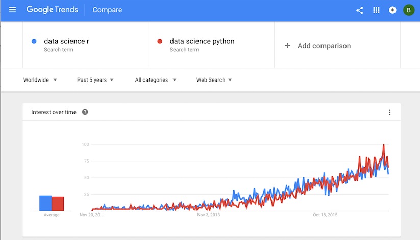

```{r setup, include=FALSE}
knitr::opts_chunk$set(echo = TRUE)
```

Welcome to LAB 5! In this lab, we will:

- Learn about how to calculate confidence intervals (CIs) for t-tests.
- Learn how to create confidence interval using bootstrap methods.
- Learn basic syntax of linear regression.


In this lab, we will look at a comic book data created by [FiveThirtyEight](https://fivethirtyeight.com/) for their story *[Comic Books Are Still Made By Men, For Men And About Men](https://fivethirtyeight.com/features/women-in-comic-books/)*, where they claimed that Comic books vastly under-represent women. Specifically, they said that woman characters have lower appearance counts after analyzing the Marvel and DC dataset. Well, is that true? Let's apply our testing methods to their analysis!

```{r}
# Read in data.
marvel <- read.csv("marvel-wikia-data.csv")
```

The data `marvel-wikia-data.csv` comes from [Marvel Wikia](http://marvel.wikia.com/Main_Page). It has the following variables:

- `page_id`: The unique identifier for that characters page within the wikia
- `name`:  The name of the character
- `urlslug`:  The unique url within the wikia that takes you to the character
- `ID`:  The identity status of the character (Secret Identity, Public identity, [on marvel only: No Dual Identity])
- `ALIGN`:  If the character is Good, Bad or Neutral
- `EYE`:  Eye color of the character
- `HAIR`:  Hair color of the character
- `SEX`:  Sex of the character (e.g. Male, Female, etc.)
- `GSM`:  If the character is a gender or sexual minority (e.g. Homosexual characters, bisexual characters)
- `ALIVE`:  If the character is alive or deceased
- `APPEARANCES`:  The number of appareances of the character in comic books (as of Sep. 2, 2014. Number will become increasingly out of date as time goes on.)
- `FIRST APPEARANCE`:  The month and year of the character's first appearance in a comic book, if available
- `YEAR`:  The year of the character's first appearance in a comic book, if available

We will focus on two columns `SEX` and `APPEARANCES`. To make thing simpler, we created two vectors `female.logappearances` and `male.logappearances` for you, which contains the log appearances counts for female and male characters separately. You will use these two vectors to do hypothesis testing in the rest of the lab.

```{r readData}
female.logappearances <- log(marvel$APPEARANCES[marvel$SEX == "Female Characters"])
male.logappearances <- log(marvel$APPEARANCES[marvel$SEX == "Male Characters"])
```

\pagebreak

# T-test confidence intervals

**Exercise 1.**

 (a) Get the confidence interval for the means of the female and male log appearance using t.test function. 

```{r ex1a}
# Insert your code here for calculating the CI, and save the CIs as 
# `log.female.ci` and `log.male.ci`
# log.female.ci <- 
# log.male.ci <- 
```

You may found that when you print the confidence interval, there is an additional line named `attr(,"conf.level")` with value 0.95. In R, all objects can have arbitrary additional attributes, used to store metadata about the object. Attributes can be accessed using `attributes()` or `attr()`. For example, to get all the attributes of `log.male.ci`: `attributes(log.male.ci)`. And to get the "conf.level" attribute of `log.male.ci`: `attr(log.male.ci, "conf.level")`. Attributes do not influence the fact that `log.male.ci` is a two-dimensional vector.

 (b) Get the confidence interval for the difference in the log appearance count for female and male using t.test function.

```{r ex1b}
# Insert your code here for calculating the CI, and save the CI as 
# `log.diff.ci`
# log.diff.ci <- 
```

 (c) Based on your calculation, which of the following statements do you support?:
A. There is no significant difference in appearance counts for male and female in Marvel comics.
B. The female character appearances count is significantly larger than the male in Marvel comics.
C. The male character appearances count is significantly larger than the female in Marvel comics.

```{r ex1c}
# Uncomment the line of your answer for this question:
# Ex1c.answer <- "A"
# Ex1c.answer <- "B"
# Ex1c.answer <- "C"
```


# Bootstrap confidence intervals

**Exercise 2.**

In this exercise, you will use bootstrap to get the confidence interval of the difference in means between female and male log appearance count.

(a) Caculate the observed difference. 

```{r ex2a}
# Insert your code here for calculating the observed difference
# `obs.d`
# obs.d <- 
```

(b) Complete the following function to calculate the bootstrapped statistic. The function only needs to calculate one bootstrapped statistic, and you will replicate it later.

```{r ex2b}
# Complete the function for calculating the bootstraped difference in means
bootOnce <- function() {
  # boot.male <- 
  # boot.female <- 
  # diff <- 
  # return(diff)
}
```

You can test whether your code work or not by run the following chunk:

```{r ex2test}
# test <- bootOnce()
# test  # This should give you a numeric value, which is a bootstrapped statstic
```

(c) Replicate the function `bootOnce` 1000 times to get 1000 bootstrapped statistics.

```{r ex2c}
# Insert your code here and save the bootstrapped differences as
# `boot`
# boot <- 
```

(d) Plot the histogram of your bootstrapped statistics.

```{r ex2d}
# Insert your code for histogram here

```

(e) Calculate the bootstrapped CI under the 0.95 confidence level. HINT: use `quantile` function to find the bounds. lower bound = (1-0.95)/2 quantile. upper bound = 1 - (1-0.95)/2 quantile.

```{r ex2e}
# Insert your code and save your bootstrapped CI as
# `boot.ci`
# boot.ci <- 
```

(f) Based on your calculation, which of the following statements is supported?: 
A. I will accept the hypothesis that there is no significant difference in appearance counts for male and female. 
B. I will reject the hypothesis that there is no significant difference in appearance counts for male and female.

```{r ex2f}
# Uncomment the line of your answer for this question:
# Ex2f.answer <- "A"
# Ex2f.answer <- "B"
```

\pagebreak

# Linear regression

Let us first look at a simulated example. You can ignore the following process about how the data was generated

```{r}
# Make some data
# X increases (noisily)
# Y is constructed so it is inversely related to xvar
set.seed(955)
xvar <- 1:20 + rnorm(20,sd=3)
yvar <- -2 * xvar + 3 + rnorm(20,sd=4)

# Make a data frame with the variables
dat <- data.frame(x=xvar, y=yvar)
# Show first few rows
head(dat)
```

To do regression on y using x as a predictor, we can call the `lm` function:

```{r}
# These two commands is equivalent
fit <- lm(y ~ x, data=dat)
fit <- lm(dat$y ~ dat$x)
```

To get the detailed information about the fit, such as coefficient estimates, t-statistics and p-values.

```{r}
summary(fit)
```

The coefficients estimation can be accessed by:

```{r}
fit$coefficients
```


To get the estimated coefficent of the intercept term:

```{r}
fit$coefficients[1]
```

To get the estimated coefficent of the slope term:

```{r}
fit$coefficients[2]
```

[Google Trends](https://www.google.com/trends/) is a web facility provided by Google, based on the volume of Google search. It provide equally spaced time series data of the search volume You may compare different topics to discover how peoples' interests change over time. You've learned two most widely-used programming languages (R and Python) for data science. But which language is more popular over time?

The following picture shows how to retrieve the Google Trends data. You may download and analysis your topics of interests as well. The dataset we obtained contains the following variables:

- **week**: beginning date of the week (recent 5 years)
- **python**: trend of the search term **Data science Python**
- **r**: trend of the search term **Data science r**



Read the data.
```{r}
data_science <- read.csv("data_science.csv")
# convert string to date object 
data_science$week <- as.Date(data_science$week, "%Y-%m-%d")
# create a numeric column representing the time
data_science$time <- as.numeric(data_science$week)
data_science$time <- data_science$time - data_science$time[1] + 1
```

**Exercise 3**

Do regression on the r index using the predictor `time`. Get the estimate of the slope.

```{r ex3}
# Insert your code here and save the estimated slope as
# `r.slope`
# r.slope <- 
# r.slope
```

\pagebreak

`r log.female.ci`

'

`r log.male.ci`

'

`r log.diff.ci`

'

`r Ex1c.answer`

'

`r obs.d`

'

`r test`

'

`r boot`

'

`r boot.ci`

'

`r Ex2f.answer`

'

`r r.slope`

