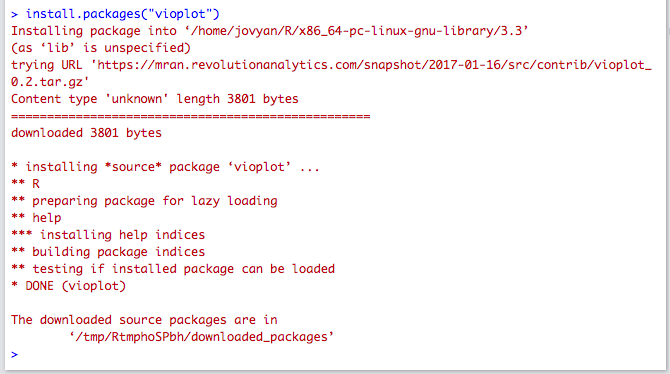

```{r setup, include=FALSE}
knitr::opts_chunk$set(echo = TRUE)
```

Welcome to the lab 2! In this lab, you will

1) Do probability calculations
2) Plot your density curve estimates;
3) Obtain some basic statistics by groups;


# Probability Distributions

There are a large number of standard parametric distributions available in R (nearly every common distribution!). To get a list of them, you can do:

```{r}
?Distributions
```

You are probably only familiar with the normal distribution. But each of them is immensely useful in statistics. You will see Chi-squared distribution, student-t distribution later in this course. Every distribution has four functions associated with it.

|Name | Explanation |
|-----|-------------|
| d | density: Probability Density Functions (pdfs) |
| p | probability: Cumulative Distribution Functions (cdfs) |
| q | quantile: the inverse of Probability Density Functions (pdfs) |
| r | random: Generate random numbers from the distribution |

**Density (pdf)** Take normal distribution $N(\mu, \sigma^2)$ for example. Let's use the `dnorm` function to calculate the density of $N(1, 2)$ at $x = 0$:

```{r}
dnorm(0, mean = 1, sd = sqrt(2))
# Notice here the parameter in dnorm is sd,
# which represents the standard deviation (sigma instead of sigma^2). 
```

Looks familiar? It is exactly same the function that you wrote in lab 0! This function can accept vectors and calculate their densities as well. 

**Cummulative Distribution Functions (cdf)** The Cummulative Distribution Functions (cdfs) gives you the probability that the random variable is less than or equal to value:
$$P(X \leq z)$$
where $z$ is a constant and $X$ is the random variable. For example, in the above example. $N(1, 2)$ is symmetric about 1. Then what would be the probability that it is less than 1?

```{r}
probs <- pnorm(1, mean = 1, sd = 2)
probs
```

**Quantiles** `qnorm` is the inverse function of `pnorm`. It accepts value $p$ (probability) from 0 to 1, and returns a value $q$ (quantile) satisfies the following condition:

$$P(X \leq q) = p$$
where $X$ is the random variable. A toy example would be:

```{r}
qtl <- qnorm(0.5, mean = 1, sd = 2)
qtl
```

Quantiles are very important in hypothesis testing, for example if you want to know what value of a test-statistic would give you a certain p-value. 

**Random number generation** The last function is very important when you simulate stuff. We use it to generate numbers from a distribution. 

```{r}
# generate 1000 samples from Normal(1, 2) distribution.
samples <- rnorm(n= 1000, mean = 1, sd = 2)
# plot the histogram
hist(samples)

```

## Plotting a function

Let's plot the line of this function (you can also use the `curve` function that the professor used for the lecture notes to draw functions).

We will be manually recreating what `curve` does: we will create a sequence of x values and then evaluate f(x) to get the corresponding y vector of values, and then plot them with `plot`

First we create the sequences

```{r}
# create a vector, spaced by 0.1
x <- seq(from = -4, to = 6, by = 0.1)
# calculate their densities
x.dens <- dnorm(x, mean = 1, sd = 2)
```

Now we will plot them

```{r}
# plot the line
plot(x, x.dens, ylab="Density, p(x)")
```

We'd really rather plot a curve, than these points. We can do this by setting `type="l"`; this makes `plot` act like the function `lines`, with the difference that it doesn't have to add to an existing plot.

```{r}
# plot the line
plot(x, x.dens,type="l", ylab="Density, p(x)",xlim=c(-4,6))
```


It's useful to know how to manually plot function as described above, but for simple functions `curve` can be cleaner

```{r}
# plot the line
curve(dnorm(x, mean = 1, sd = 2),from=-4,to=6, 
      ylab="Density, p(x)")
```

We can also overlay the density on top of the histogram, but we need to make sure the histogram is on the density scale:

```{r}
hist(samples, freq=FALSE,xlim=c(-4,6))
curve(dnorm(x, mean = 1, sd = 2),
      ylab="Density, p(x)", add=TRUE)


```


\pagebreak

**Exercise 1.**

(a) $X_1$ follows Normal Distribution $N(3.5, 9)$. What is the probability that $-2.5 < X \leq 9.5$? 

```{r e1a}
# insert code here save the your answer as
# 'ex.1a'
```

(b) $X_2$ follows Normal Distribution $N(3.5, 9)$. Theoretically, what is the expected value of the interquartile range (IQR) if we plot samples from $X_2$? (HINT: IQR = 0.75 quantile - 0.25 quantile.)

```{r e1b}
# insert code here save the value of the interquartile range as
# 'iqr.value'
```

\pagebreak

## Set Seed

The random numbers and random samples generated in R are produced by a random number generator. The process is not really "random", but mimic the results of what we would get from the random process. Thus, unlike a truly random process, the random numbers can be tracked and be exactly reproduce. For example, if you run a permutation test function for two times, you would get two very close but different p-values. But if you set the seed to be the same number before you run the permutation test, you would obtain the exact same p-values. Throughout the rest of the course where random number generation is involved, we would set seed of the random number generator such that the results are fully reproducible (important for grading purposes!). However, in the real application, you would generally change it. 

The following chunk illustrate how `set.seed` influence the random number generation. 

```{r}
set.seed(201728)
sample(x = 1:5, size = 3) # after calling this function, the seed will be updated
sample(x = 1:5, size = 3) # the seed has changed thus we would get a different number
set.seed(201728) # set the seed back to 201728
sample(x = 1:5, size = 3)
```

It is the same with `rnorm`:

```{r}
set.seed(20170126)
rnorm(5, mean = 0, sd = 1)
rnorm(5, mean = 0, sd = 1)
set.seed(20170126)
rnorm(5, mean = 0, sd = 1)
```


# Density Curves and Violin Plot


## Bring in data

We will continue to use the rent price dataset from the lab 1. In the table **craigslist.csv**, each posting record (row) contains the following information:

- time: posting time
- price: apartment/housing monthly rent price
- size: apartment/housing size (ft^2)
- brs: number of bedrooms
- title: posting title
- link: posting link, add "https://sfbay.craigslist.org" to visit the posting page
- location: cities

Read in data. Create `one.bedrooms` data frame of only postings for 1 bedroom.

```{r}
craigslist <- read.csv("craigslist.csv", 
                       header = TRUE)
one.bedrooms <- craigslist[craigslist$brs == 1,]
```


## Kernel Density estimates

The function `density` will estimate a kernel density from the input data. Below, I calculate the density for the size of the apartments. It does not accept NA values, so I will use the function `na.omit` to get a vector of values excluding the NA's (though just excluding this data might give suspect conclusions!)

```{r}
d<-density(na.omit(craigslist$size))
plot(d,col="blue", main="Kernel Density Estimate of apartment sizes")
```

Notice that the object `d` this creates is a complicated object. I can call `plot` on it, and it creates a reasonable plot because there is a built in plotting function that is triggered by calling plot on `d` (R's version of object-oriented programming, if you are familiar with that).

\pagebreak

**Exercise 2** 

There is a similar built-in `lines` function that allows for adding the plot of the estimated density on an existing plot. Use this function to first plot a histogram of the `price` variable, with the kernel density estimate overlaid on top.

```{r e2}
# insert your code here
```

\pagebreak

# Violin Plots

To plot violin plots, we will use the function available in a user-contributed package called `vioplot`. R is very powerful in statistical analysis mainly due to a huge community that supports it. Experts contribute to R through packages which are easily accessible (through [CRAN](https://cran.r-project.org/)). 

## Installation (for personal computer)

If you want to use this function on your own computer, you will likely need to install this package (for the lab these have already been installed on the hub). There are two ways to install R packages.

**Installation using Studio Interface**

- Open you RStudio.
- Click `Packages` window in the bottom right panel and then click install.
- A window named `install packages` will pop up. Enter the name of packages you want to install. For example, `vioplot` from lecture 1. Make sure you checked `install dependencies` and then click `Install`.
- If you see the messages in the console similar to the following, you've successfully installed the package! Sometimes the messages will be much longer because many R packages use the code from others (dependencies), and R will need to download and install the dependencies as well. 

- The package name will then appear in the list of `Packages` window. There are already a collection of packages in the list, which we previously installed for you.

**Installation using R Code**

There is a much quicker alternative than clicking bottoms in the first method. You will only need to run the following code (right now it has `eval=FALSE` meaning the markdown will not run it:

```{r, eval=FALSE}
install.packages("vioplot")
```

## Using vioplot

Once the package is installed, to use functions from your installed packages, you will need to load them by running `library` function.

For example, to load the `vioplot` package:

```{r}
library(vioplot)
```

The `vioplot` function just draws a simple violin plot:

```{r}
vioplot(craigslist$size)
```

To do divide the data into groups and do multiple violin plots for each group, Professor Purdom has written a function that is available online. You can read in code from online just as you would from your file using `source`:

```{r}
source("http://www.stat.berkeley.edu/~epurdom/RcodeForClasses/myvioplot.R")
```

Now the function `vioplot2` takes the argument `x` that contains the data and `fac` which is the factor variable dividing the data into groups

```{r}
craigsNoNA<-na.omit(craigslist[,c("size","brs")])
with(craigsNoNA, vioplot2(size,brs))
```

Notice I had to again remove the NAs, but this time of *both* variables (if I removed only from one, they wouldn't have matched). 

`with` can be a handy function to use to avoid typing the `$` all of the time. It also makes it easier to replicate code for different subsets of the data

```{r}
craigsNoNA2<-subset(craigsNoNA,brs<=2)
with(craigsNoNA2, vioplot2(size,brs,col=c("red","blue")))
```

\pagebreak

**Exercise 3** 

Draw the violin plot of one bedroom rent price split by cities. Do not forget to add titles, axes labels, and legend. Use the function `palette` to provide different colors to the `vioplot2`

```{r e3}
# insert your code here
```

\pagebreak
# Summarize dataset by groups

In this dataset, we are more interested in the summaries of rent price by cities. The `tapply` function is useful when we need to break a vector into groups (subvectors), and apply a function (for example, the `mean` function) within each group. The usage is:

```{}
tapply(Variable_of_interest, Factor_vector_representing_groups, Function_you_want_to_apply_on)
```

For example, to obtain the median rent price by cities.

```{r}
tapply(craigslist$price, craigslist$location, median)
```

You can write and apply your own functions. For example, to get the percentage of rent price less than $2000/month by city.

```{r}
tapply(craigslist$price, craigslist$location, function(x){mean(x < 2000)})
```

The rent price in Berkeley is much better than Palo Alto! The median monthly rent is much lower. And the percentage of rent price less than $2000 per month is much higher. But do not rush to conclusions, let us break down the dataset further. 

\pagebreak

**Exercise 4** 

Use `tapply` to get following statistics for each city.

(a) The percentage of listings that are one bedroom;

```{r e4a}
# insert code here save the precentage of one bedrooms by cites as
# 'pct.1b'


```

(b) the median price of one bedroom listings. (Use the subset `one.bedrooms` created above)

```{r e4b}
# insert code here save the median of one bedrooms by cites as
# 'med.ib'


```

\pagebreak

There are more one-bedroom rent postings in Berkeley. The median prices of one-bedrooms are less different for Berkeley and Palo Alto. The fact that the overall median price differs may be caused by the large proportion of small apartment postings in Berkeley. How you obtain the sample may greatly influence your results. Lets look at a stratified sampling dataset, where houses/apartments with 1, 2, 3 bedrooms account for 40\%, 40\%, 20\% of the total samples of each city.

```{r}
prop = c(0.4, 0.4, 0.2)
samples = c()
for (city in unique(craigslist$location)){
  for (b in 1:3){
    samples = c(samples, sample(which(craigslist$brs == b & craigslist$location == city), prop[b]*60))
  }
}
craigslist.srs <- craigslist[samples, ]
```

Now we look at the median rent price by cities for the stratified sampling dataset.

```{r}
tapply(craigslist.srs$price, craigslist.srs$location, median)
```

Below is the percentage of rent price less than $2000/month by cities for the stratified sampling dataset.

```{r}
tapply(craigslist.srs$price, craigslist.srs$location, function(x){mean(x < 2000)})
```

Now the difference of price median between Berkeley and Palo Alto is reduced compared to the SRS sample. This is a case where simple random samples may be misleading. The results from stratified samples may well depend on how you assign the proportions to each stratum. Care must be taken before you reach conclusions.


