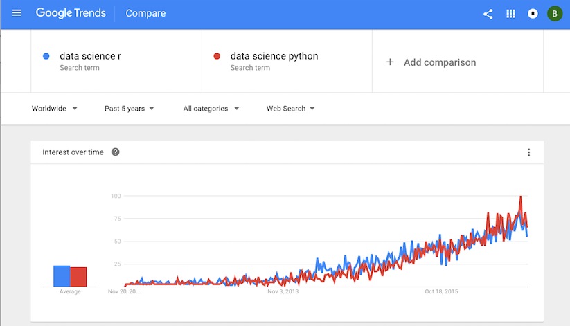

```{r setup, include=FALSE}
knitr::opts_chunk$set(echo = TRUE,
											fig.width = 4,
											fig.height = 3.5,
											fig.align = 'center')
library(ggplot2)
library(tidyverse)
```

Welcome to lab 7! In this lab, you will:

- Learn how to construct bootstrap confidence interval for linear regression.
- Explore some details for making plots.


# Linear Regression

We will continue working with the Google Trend dataset for R and Python. Recall the dataset we obtained contains the following variables:

- **week**: beginning date of the week (recent 5 years)
- **python**: trend of the search term **Data science Python**
- **r**: trend of the search term **Data science r**


Read the data.

```{r}
data_science <- read.csv("data_science.csv")
# convert string to date object 
data_science$week <- as.Date(data_science$week, "%Y-%m-%d")
# create a numeric column representing the time
data_science$time <- as.numeric(data_science$week)
data_science$time <- data_science$time - data_science$time[1] + 1
```

We find that there might be a linear relationship between the trend of search terms and time. Fit a linear regression with each terms on time and get an estimate of the slope ($\beta_1$) and intercept ($\beta_0$).

```{r conduct lm fit}
python.lm <- lm(python ~ time, data = data_science)
r.lm <- lm(r ~ time, data = data_science)
```

After obtaining the estimates, based on the assumption on the random noises, we can conduct some inferences. The null hypotheses are $H_0:\beta_1 = 0$ and $H_1:\beta_0=0$. One way to get the confidence interval is bootstrap confidence interval. 

Recall what we did in lab 06, the steps for 95\% bootstrap confidence interval:

- Take a sample of size n $X_1,\dots, X_n$ from your population and calculate the parameter of interest $\theta$.
-  Resample from your sample with replacement and size n for $B$ times. Compute the estimate of parameter  $\theta$ for each new sample and obtain: $\theta^*_1, \dots, \theta^*_B$.
- Subtract $\hat \theta$ from each $\theta^*_i$ and get $\theta^*_1 - \hat \theta, \dots, \theta^*_B-\hat\theta$
- Find the 0.025 quantile and 0.975 quantile from $\{\theta^*_i - \hat \theta\}_{i=1}^B$. Denote $a = 0.025$ quantile and $b=0.975$ quantile.
- Bootstrap 95\% CI for $\theta$ is $[\hat\theta - b, \hat \theta -a]$


# More on plots in R

### Function `plot`

The function `plot` is the most standard plotting function in R. When taking only one vector, it plots the vector against the index vector. 

```{r, fig.width=6, fig.height=3.5}
plot(data_science$python)

#tidyverse
data_science %>% ggplot()+geom_point(aes(x=1:length(python), y=python))
```

When taking two vectors, it plots the scatter plot.

```{r, fig.width=6, fig.height=3.5}
plot(data_science$time, data_science$r)

#tidyverse
data_science %>% ggplot()+geom_point(aes(x=time, y=r))
```

The `plot` function can also accept a data frame as the parameter. And it plots all variables against each other.

```{r, fig.width=6, fig.height=3.5}
plot(data_science)
```

### Low-level graphics functions

The `plot` function introduced above is a high-level plot function, which produces complete plots. There are also low-level functions that add further outputs to an existing plot. You have already seen some high-level functions such as `hist`, `boxplot` and `curve`. `lines` is a low-level function which can not be called directly.

Commenly used low-level functions includes:

- `points(x, y)`: Adds points to the current plot. `x` and `y` are vectors of coordinates.
- `lines(x, y)`: Add line to the current plot by joining the points with line segments.
- `text(x, y, labels, ...)`: Add text to a plot at points given by x, y.
- `abline(a, b)`:  Adds a line of slope b and intercept a to the current plot.
- `abline(h=y)`: Adds a horizontal line.
- `abline(v=x) `: Adds a vertical line.
- `legend(x, y, legend, ...,lty = c())`: Add legends to plots

```{r, fig.width=6, fig.height=4}
curve(dnorm, xlim = c(-3, 3), ylim = c(0, 0.5))  # create a plot for the density of normal distribution
lines(density(rnorm(1000)), col = "red") # add a line (kernel density estimation) to the plot created
abline(v=qnorm(0.025)) # add a vertical line (0.025 quanitle of standrad normal distribution)
abline(v=qnorm(0.975)) # add a vertical line (0.975 quanitle of standrad normal distribution)
text(-2, 0.3, "0.025 quantile") # add text
text(2, 0.3, "0.975 quantile") # add text
legend("topright", c("density function", "density estimation"), 
       lwd=c(2.5,2.5), # Line widths in the legend
       col=c("black", "red")) # Add legend

#tidyverse
ggplot(data = data.frame(data = rnorm(1000)))+
        stat_function(fun = dnorm, mapping=aes(color = 'density function'))+
        geom_density(aes(x=data, color = 'density estimation'))+
        geom_vline(xintercept=qnorm(0.025))+
        geom_vline(xintercept=qnorm(0.975))+
        scale_colour_manual("", 
                      breaks = c("density function", "density estimation"),
                      values = c("black", "red"))+
        xlab("x")+
        xlim(-3,3)+
        ylim(0,0.5)+
        theme(legend.position = c(0.8, 0.9))
```

### par()

The par() function is used to access and modify the list of graphics parameters. For example, to put several plots in the same window, use `par(mfrow = c(a, b))`. `a` is the number of rows and `b` is the number of columns. This command will allow you to plot `a*b` plots in one window.

```{r, fig.width=6, fig.height=4}
par(mfrow=c(1, 2))
plot(data_science$time, data_science$r)
plot(data_science$time, data_science$python)

#tidyverse
data_science %>% pivot_longer(
	cols = c(r, python),
	names_to = "Language",
	values_to = "Search index"
) %>% ggplot(aes(x = time, y = `Search index`)) +
	geom_point() + facet_wrap(. ~ Language) +
	theme_bw()
```

### patchwork

There is a useful package to combine separate ggplots into the same graphic, "patchwork". 
```{r}
# Uncomment the following lines to install the packages 
# install.packages("devtools")
# devtools::install_github("thomasp85/patchwork")
```

```{r}
library(ggplot2)
library(patchwork)

p1 <- ggplot(mtcars) + geom_point(aes(mpg, disp))
p2 <- ggplot(mtcars) + geom_boxplot(aes(gear, disp, group = gear))

p1 + p2 
```

```{r, warning=FALSE}
p3 <- ggplot(mtcars) + geom_smooth(aes(disp, qsec), formula = 'y~x' ,method = 'loess')
p4 <- ggplot(mtcars) + geom_bar(aes(carb))


(p1 | p2 | p3) /
      p4

(p1 | p2)/
  (p3 | p4)
```


Other functions or packages for arranging ggplots: gridExtra::grid.arrange() and cowplot::plot_grid. 


\pagebreak

**Exercise 1.**

Functions and plots for the lm fit.

```{r}
summary(r.lm)
```

(a) Get the coefficients of the linear models fit on `data science r` search index using function `coef`. (This is equivalent to the dollar sign plus "coefficients")

```{r}
# Insert your code here and save the coefficients vector 

```

(b) Get the confidence intervals of the linear models fit on `data science r` search index using function `confint`. 

```{r}
# Insert your code here and save the confidence intervals 

```

(c) Get bootstrap confidence intervals of $\beta_0$ and $\beta_1$. Complete the following codes and print out your results. Compare the bootstrap CI with the parametric CI. What do you observe? How to make a conclusion on the null hypothesis based on your confidence interval?

```{r}
# We already got the estimate in r.lm
# Insert your code here and save the confidence intervals
bootOnce <- function() {
  # boot.index <- sample()
  
  # Use the index to get Y and X
  # y.sample <- 
  # x.sample <- 
    
  # Fit the linear regression with the new data
  # fit.model <- 
  
  # Get the estimate and return the results
  # coef <- 
  # return()
}
```

Replicate the function `bootOnce` 1000 times to get 1000 bootstrapped statistics.

```{r replicate}
# Complete the codes
# boot.stats <- 
```

```{r bootstrapCI}
# Subtract the original estimates from boot.stats
# quantile.seq <- boot.stats - r.lm$coefficients

# Get the quantiles


# Confidence intervals

```

Compare the bootstrap CI with the parametric CI. What do you observe? How to make a conclusion on the null hypothesis based on your confidence interval?

```{Answer}


```


**Exercise 2**

Continuous questions on prediction.

(a) Get the prediction of `data science r` search index on "2013-01-06" (time point 435) and "2015-01-04"(time point 1163), using function `predict`. What is the absolute error of the prediction?

HINT: absolute error = |prediction - true value|

```{r}
# Insert your code here and save the coefficients vector and prediction error 

# Insert your code here and save the coefficients vector and prediction error 


```

(b) Get the prediction intervals of data science research index on “2013-01-06” (time point 435) and“2015-01-04”(time point 1163), using function predict. Do your prediction intervals contains the actual values?

```{r}
# Insert your code here and save the prediction interval as
#`pred.int.2013`

# Insert your code here and save the prediction interval as
#`pred.int.2015`

```

(c) Plot the fittings. Plot the scatter plot of time versus the search index for `data science r` and `data science python`. Color the points with red and blue. Plot the fitted linear line with color. 

```{r}
# Insert your code here

```

(Question Extra for Experts) (Not required) You might notice that in the data_science data frame, there is another column called week, which gives the actual dates instead of the time point integers. The date information is saved in another data type called Date. When fitting linear models, we can not use the Datetype. However, the integers are not informative for plotting. Can you figure out a way to plot the dates instead of integers for the x axis in (e)?

```{r}
# Insert your code here

```


