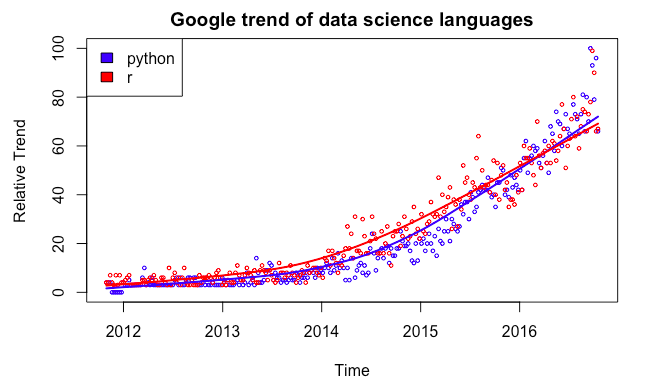

```{r setup, include=FALSE}
knitr::opts_chunk$set(echo = TRUE,
                      fig.width = 6,
											fig.height = 4,
											fig.align = 'center')
library(tidyverse)
```

Welcome to LAB 8!


Read the data.
```{r}
data_science <- read.csv("data_science.csv")
# convert string to date object
data_science$week <- as.Date(data_science$week, "%Y-%m-%d")
# create a numeric column representing the time
data_science$time <- as.numeric(data_science$week) 
data_science$time <- data_science$time - data_science$time[1] + 1
```

```{r, echo=FALSE}
python.lm <- lm(python ~ time, data = data_science)
r.lm <- lm(r ~ time, data = data_science)
plot(data_science$time, data_science$python, cex = 0.5, col = "blue4",xlab = "Time", ylab = "Relative Trend",main = "Google trend of data science languages")
abline(python.lm$coefficients[1], python.lm$coefficients[2], col = "blue4")
points(data_science$time, data_science$r, cex = 0.5, col = "red4")
abline(r.lm$coefficients[1], r.lm$coefficients[2], col = "red4")
legend("topleft",c("python", "r"), fill=c("blue4","red4"))

```


# Polynomial models

## Exercise 1 
As you may discover, the linear model is not quite good for your dataset. In this exercise, you will fit a cubic curve to the data (use time to predict `r` and `python`).

(a) Fit the cubic model.

```{r}
# Insert your code here and save your fitted model as
# `python.poly` and `r.poly`
# python.poly <- 
# summary(python.poly)
# r.poly <- 
# summary(r.poly)
```

(b) In the fitting for `r` and `python` search index, which of the following term is significant (not equal to zero)?

```{r}
# Uncomment the line of your answer for this question: (r)
# intercept.r.sig <- TRUE
# time.r.sig <- TRUE
# time.r.square.sig <- TRUE
# time.r.cubic.sig <- TRUE
```

```{r}
# Uncomment the line of your answer for this question: (python)
# intercept.python.sig <- TRUE
# time.python.sig <- TRUE
# time.python.square.sig <- TRUE
# time.python.cubic.sig <- TRUE
```

(c) Plot the scatter plot and the fitted line. Color the groups with red and blue. How will you describe the trend of r search and python search?

```{r}
# Insert your code here for plotting

```

\pagebreak

## Reading - Caveat

Google trend seems so powerful and accessible. However, when analyzing some topics, we would rather not to use it. Why? Consider the following two examples.

### Global Warming & Pirates

Back to 2008, there is an obvious negative correlation between [global warming and pirate](https://www.google.com/trends/explore?date=2008-02-01\%202008-04-30&q=global\%20warming,pirates) searching, which may just be a coincidence. If you fit a linear model, the coefficients are significant.

```{r}
pirate <- read.csv("pirate.csv")
pirate$Day <- as.Date(pirate$Day, "%Y-%m-%d")
data_science$time <- as.numeric(data_science$week)
data_science$time <- as.numeric(data_science$week) - as.numeric(data_science$week)[1]
```

```{r}
plot(unclass(pirate$Day), pirate$pirates, cex = 0.5, col = "blue4",
     xlab = "Time", ylab = "Relative Trend", ylim = c(0, 100),
     main = "Google trend of priate and global warming", xaxt='n')
axis(1, at = pirate$Day[c(1, 30, 61, 90)], 
     labels = as.character(pirate$Day)[c(1, 30, 61, 90)])
points(pirate$Day, pirate$global.warming, cex = 0.5, col = "red4")
lines(pirate$Day, pirate$pirates, col = "blue")
lines(pirate$Day, pirate$global.warming, col = "red")
legend("topright", legend = c("pirate", "global warming"), 
       fill = c("blue4", "red4"))
```


```{r}
pirate.lm <- lm(global.warming ~ pirates, data = pirate)

plot(pirate$pirates, pirate$global.warming, cex = 0.5, col = "blue4",
     xlab = "pirates", ylab = "global warming",
     main = "Google trend of pirate and gobal warming")
abline(pirate.lm)

cor(pirate$pirates, pirate$global.warming)
```

```{r}
summary(pirate.lm)
```

### The Failure of Google Flu Trend

[Google Flu Trend](https://www.google.org/flutrends/about/) was first launched in 2008 (The Google research paper: [Detecting influenza epidemics using search engine query data](http://static.googleusercontent.com/media/research.google.com/zh-CN//archive/papers/detecting-influenza-epidemics.pdf)). It was widely recognized an exciting event in the big data application In the 2009 flu pandemic, Google Flu Trends tracked information about flu in the United States. In February 2010, the CDC (the U.S. Centers for Disease Control and Prevention) identified influenza cases spiking in the mid-Atlantic region of the United States. However, Google’s data of search queries about flu symptoms was able to show that same spike two weeks prior to the CDC report being released.

The model was initially based on the flu data from 2003-2008. Google Flu Trend prediction performs well at the beginning. However, it’s been wrong since August 2011. The subsequent report continuously overestimates the flu prevalence. And now Google Flu Trends is no longer publishing current estimates of Flu based on search patterns.

In a Science article, a team of researchers described Google Flu Trend as "Big Data Hubris":

"The core challenge is that most big data that
have received popular attention are not the
output of instruments designed to produce
valid and reliable data amenable for scientific analysis."

```{r}
flu <- read.csv("flu.csv", stringsAsFactors = FALSE)
flu$Date <- as.Date(flu$Date)
```

```{r}
plot(flu$Date, flu$California, 
     type = "o", cex = 0.4, 
     xlab="Age (days)",
     ylab="Circumference (mm)" )
```

Reference and further reading:

- [The Parable of Google Flu: Traps in Big Data Analysis](http://science.sciencemag.org/content/343/6176/1203.figures-only)

- [Google Flu Trends’ Failure Shows Good Data > Big Data](https://hbr.org/2014/03/google-flu-trends-failure-shows-good-data-big-data)

- [Google Flu Trend](https://en.wikipedia.org/wiki/Google_Flu_Trends#cite_note-pcworld-4)

\pagebreak

# LOESS: Local Polynomial Regression Fitting

There are several options in `R` for fitting a loess.

The function `loess.smooth()` returns a list with the smoothed data coordinates:

```{r}
loess.results <- loess.smooth(x = data_science$week, y = data_science$r)
loess.results
plot(loess.results$x, loess.results$y)
```

Though `loess.smooth()` is convenient for plotting the smoothed fit, there is also `scatter.smooth()`, which prints both the scatter plot and the smoothed fit with just one line of code.

```{r}
scatter.smooth(x=data_science$time,y=data_science$r)
```

Using `ggplot2`, we have

```{r, message = F}

data_science %>% ggplot(aes(
	x = time, y = r
)) + geom_point(size = 0.7) +
	geom_smooth(
		method = 'loess', span = 2/3,
		formula = y ~ poly(x, degree = 1),
		se = F) +
	theme_bw()
```

To do prediction using a LOESS model, there is function `loess()`, which has similar usage as the `lm()` function. Notice the default smoothing parameter for `loess.smooth(span = 2/3, degree = 1)` and `loess(span = 0.75, degree = 2)` are different.

```{r}
loess.fitted <- loess(r~time, data = data_science)
summary(loess.fitted)
```

```{r}
predict(loess.fitted, data.frame(time = c(1000, 1500)))
```

## Exercise 2

Follow the steps below to create a plot:

(1) Plot a scatter plot of `week` versus `r` and `week` versus `python` in the same pane; distinguish `r` from `python` by color.

(2) Overlay the scatter plots with a LOESS smoothing line for both `r` and `python` appropriately matched colors.

(3) Make sure that a legend is included in the plot.

Your plot should look something like the following:



```{r}
# Insert your code here


```


