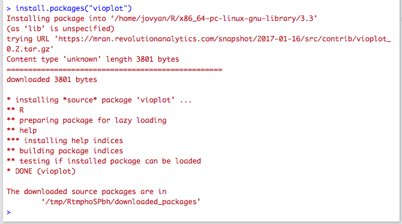

```{r setup, include=FALSE}
knitr::opts_chunk$set(echo = TRUE)
library(ggplot2)
```

Welcome to the lab 3! In this lab, we will focus on

1) Histograms (ggplot2)
2) Kernel Density
3) Violin Plots


## Bring in data

We will continue to use the rent price dataset from the lab 1. In the table **craigslist.csv**, each posting record (row) contains the following information:

- time: posting time
- price: apartment/housing monthly rent price
- size: apartment/housing size (ft^2)
- brs: number of bedrooms
- title: posting title
- link: posting link, add "https://sfbay.craigslist.org" to visit the posting page
- location: cities


Read in data. Create `one.bedrooms` data frame of only postings for 1 bedroom.

```{r}
craigslist <- read.csv("craigslist.csv", 
                       header = TRUE)
one.bedrooms <- craigslist[craigslist$brs == 1,]
```

## Histograms in ggplot

We can use ggplot to generate histogram of prices. 

```{r}
ggplot(craigslist) + geom_histogram(aes(x = price),binwidth = 200) + xlab("Price")
```

Generate a histogram of prices for one bedrooms in the craigslist data
**Exercise 1** 

```{r e1a}
## Your code here

```


Generate a histogram of prices for two bedrooms in the craigslist data
```{r e1b}
## Your code here

```


We can overlay the histograms in ggplot

```{r}
OneTwoBedrooms = subset(craigslist, brs <=2)
OneTwoBedrooms$Bedrooms = as.factor(OneTwoBedrooms$brs)

ggplot(OneTwoBedrooms) + geom_histogram(aes(x = price, group =Bedrooms,fill = Bedrooms)) + xlab("Price")
```

The histograms are displayed on top of each other. We can position argument to display them separately

```{r}

ggplot(OneTwoBedrooms) + geom_histogram(aes(x = price, group =Bedrooms,fill = Bedrooms),position = "dodge")+ xlab("Price")
```
Create an overlay-ed histogram of price by bedrooms (1-4) from craigslist 

```{r e1c}


```


Create separate histograms of price by bedrooms using facet_wrap function

```{r e1d}


```

## Kernel Density estimates

The function `density` will estimate a kernel density from the input data. Below, I calculate the density for the size of the apartments. It does not accept NA values, so I will use the function `na.omit` to get a vector of values excluding the NA's (though just excluding this data might give suspect conclusions!)

```{r}
d <- density(na.omit(craigslist$price))
plot(d,col="blue", main="Kernel Density Estimate of apartment prices")
```

Notice that the object `d` this creates is a complicated object. I can call `plot` on it, and it creates a reasonable plot because there is a built in plotting function that is triggered by calling plot on `d` (R's version of object-oriented programming, if you are familiar with that).


```{r}
x_df <- data.frame(x = d$x, x.dens = d$y)
#ggplot is designed for data.frame
ggplot(x_df, aes(x = x, y = x.dens)) +
  geom_line(color = "blue") +
  labs(y = 'Density, p(x)', title = 'Kernel Density Estimate of apartment price') +
  theme_bw()
```

\pagebreak

**Exercise 2** 

There is a similar built-in `lines` function that allows for adding the plot of the estimated density on an existing plot. Use this function to first plot a histogram of the `price` variable, with the kernel density estimate overlaid on top.

```{r e2}
# insert your code here
```


For this exercise, experiment with the `bw` argument in the density function, which stands for the bandwidth (width of the the moving window) of the kernel density function. For example, start with `bw = 1`, and scale up by a multiple of 10, until `bw` is greater than $n$, where $n$ is the number of observations. Observe how the resulting curves change.

```{r}
price <- craigslist$price
d <- density(na.omit(price), bw = 100)
hist(price,
     freq = FALSE,
     ylim = c(0, 0.0005),
     breaks = 50)
lines(d, col = "red")
```

We can recreate the histogram and kernel density curve using `ggplot2`

```{r}
# install.packages("tidyverse")

ggplot(craigslist, aes(x = price, y = after_stat(density))) +
  geom_histogram(bins = 50, fill = "lightgrey", color = "black") +
  geom_density(bw = 100, color = "red") +
  labs(x = "Price", y = "Density") +
  ggtitle("Histogram of price") +
  theme_bw()
```
**Exercise 3**

(a) What value of bandwidth (approximately) is used as default by the density function on monthly rents? (In other words, what value of the `bw` argument results in the same kernel density estimation as not specifying the `bw` argument?)\newline
  _Bonus:_ what is the actual default bandwidth?\newline

```{r e3a}
# Your answer here

```


(b) How does changing the bandwidth affect the density estimation curve? Briefly explain your intuition on why that is the case.\newline
```{r e3b}
# Your answer here

```

\pagebreak

# Violin Plots

To plot violin plots, we will use the function available in a user-contributed package called `vioplot`. R is very powerful in statistical analysis mainly due to a huge community that supports it. Experts contribute to R through packages which are easily accessible (through [CRAN](https://cran.r-project.org/)). 

## Installation (for personal computer)

If you want to use this function on your own computer, you will likely need to install this package (for the lab these have already been installed on the hub). There are two ways to install R packages.

**Installation using Studio Interface**

- Open you RStudio.
- Click `Packages` window in the bottom right panel and then click install.
- A window named `install packages` will pop up. Enter the name of packages you want to install. For example, `vioplot` from lecture 1. Make sure you checked `install dependencies` and then click `Install`.
- If you see the messages in the console similar to the following, you've successfully installed the package! Sometimes the messages will be much longer because many R packages use the code from others (dependencies), and R will need to download and install the dependencies as well. 

- The package name will then appear in the list of `Packages` window. There are already a collection of packages in the list, which we previously installed for you.

**Installation using R Code**

There is a much quicker alternative than clicking bottoms in the first method. You will only need to run the following code (right now it has `eval=FALSE` meaning the markdown will not run it:

```{r, eval=FALSE}
install.packages("vioplot")
```
## Using vioplot

Once the package is installed, to use functions from your installed packages, you will need to load them by running `library` function.

For example, to load the `vioplot` package:

```{r, warning=FALSE, message=FALSE, echo = F}
library(vioplot)
```

The `vioplot` function just draws a simple violin plot:

```{r}
whethermissing <- as.numeric(is.na(craigslist$size))
df <- data.frame(mis = whethermissing, size = craigslist$size)
vioplot(size~mis, data = df, xlab = "")
```

```{r}
vioplot(na.omit(craigslist$size))
```

```{r}
ggplot(df, aes(x = mis, y = size)) + geom_violin(na.rm = T) +
  theme_bw()
```

One way using 'ggplot' without creating a new dataframe.
```{r}
ggplot(data = craigslist, aes(x = 0, y = size)) + 
  stat_ydensity( geom = "violin", position = "dodge", bw = "nrd0",
                 adjust = 0.5, kernel = "gaussian", trim = F, na.rm = T)+
  theme_bw()
```

To do divide the data into groups and do multiple violin plots for each group, Professor Purdom has written a function that is available online. You can read in code from online just as you would from your file using `source`:

```{r}
source("http://www.stat.berkeley.edu/~epurdom/RcodeForClasses/myvioplot.R")
```

Now the function `vioplot2` takes the argument `x` that contains the data and `fac` which is the factor variable dividing the data into groups

```{r}
craigsNoNA<-na.omit(craigslist[,c("size","brs")])
with(craigsNoNA, vioplot2(size,brs))
```

Notice I had to again remove the NAs, but this time of *both* variables (if I removed only from one, they wouldn't have matched). 

`with` can be a handy function to use to avoid typing the `$` all of the time. It also makes it easier to replicate code for different subsets of the data

```{r}
craigsNoNA2<-subset(craigsNoNA,brs<=2)
with(craigsNoNA2, vioplot2(size,brs,col=c("red","blue")))
```

```{r}
ggplot(craigslist, aes(x = as.factor(brs), y = size, fill = as.factor(brs))) + 
  geom_violin(na.rm = T)+
  # + geom_boxplot(na.rm = T)
  labs(x = "brs", fill = "brs")
```

```{r}
  ggplot(OneTwoBedrooms, aes(x = as.factor(brs), y = size)) + 
  geom_violin(na.rm = T) + 
  labs(x = "brs")
```

How to interpret the violin plot? The white point stands for the median, the black box in the middle represents the upper quartile and lower quartile. The outlines show the shape of the kernel density and are symmetric around the middle line. 

\pagebreak

**Exercise 4** 

Draw the violin plot of one bedroom rent price split by cities. Do not forget to add titles, axes labels, and legend. Use the function `palette` to provide different colors to the `vioplot2`

```{r e4}
# insert your code here
```

