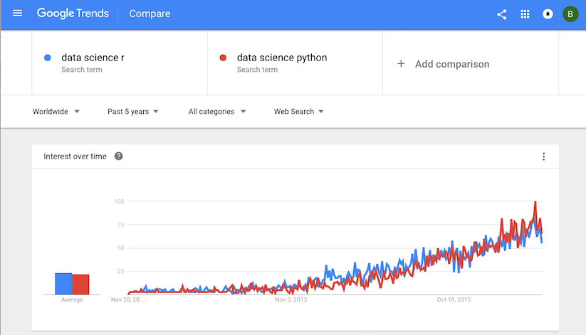

In this lab we will go over

1. Linear Regression
2. Review Parametric Models 
3. Confidence Intervals


# Linear regression

Let us first look at a simulated example,


```{r e1a, echo=FALSE}
# Make some data
# X increases (noisily)
# Y is constructed so it is inversely related to xvar
set.seed(955)
xvar <- 1:20 
yvar <- -2*xvar + 3 + rnorm(20,sd=4)

# Make a data frame with the variables
dat <- data.frame(x=xvar, y=yvar)
# Show first few rows
#head(dat)
```
**Exercise 1**
What are the values of different parameters $\beta_0$, $\beta_1$, $e$?

```{r}
# Your answer here ...

```


To do regression of $y$ on $x$ as a predictor, we can call the `lm` function:

```{r}
# These two commands are equivalent
fit <- lm(y ~ x, data=dat)
fit <- lm(dat$y ~ dat$x)
```

To get detailed information about the fit, such as coefficient estimates, $t$-statistics and $p$-values:

```{r}
summary(fit)
```

The coefficients estimation can be accessed:

```{r}
fit$coefficients
```


To get the estimated intercept term:

```{r}
fit$coefficients[1]
```

To get the estimated slope term:

```{r}
fit$coefficients[2]
```

__

[Google Trends](https://www.google.com/trends/) is a Google web tool providing equally-spaced time series data on the search volume. You may compare different topics to discover how peoples' interests change over time. You already code in at least one of the two most widely-used programming languages for data science (`R` and Python). Which language is more popular over time?

The following picture shows how to retrieve the Google Trends data. You may download and analyze your topics of interests as well. The dataset we obtained contains the following variables:

- **week**: beginning date of the week (recent 5 years)
- **python**: trend of the search term **Data science Python**
- **r**: trend of the search term **Data science r**



Read the data.
```{r}
data_science <- read.csv("data_science.csv")
# convert string to date object 
data_science$week <- as.Date(data_science$week, "%Y-%m-%d")
# create a numeric column representing the time
data_science$time <- as.numeric(data_science$week)
data_science$time <- data_science$time - data_science$time[1] + 1
```

**Exercise 2**
The plot in the Google Trend page looks somewhat linear. So we will try linear model first. Note that in the `lm` function for the model $y = \beta_0 + \beta_1x + e$, you don't need to add the intercept term explicitly. Fitting the model with an intercept term is the default when you pass the formula as `y ~ x`. If you would like to fit a model without an intercept($y = \beta_1x + e$, ), you need the formula `y ~ x - 1`.

Run a regression of the `r` index on the predictor `time`. Get the estimate of the slope.

```{r ex4}
# Insert your code here and save the estimated slope as
# `r.slope`
# r.slope <- 
# r.slope
```
\pagebreak

**Exercise 3.**
Let's expand the analysis to include R and python
```{r}
python.lm <- lm(python ~ time, data = data_science)
r.lm <- lm(r ~ time, data = data_science)
```

```{r}
summary(r.lm)
```


Read the output of `summary(r.lm)`.

(a) Which of the following formula will you use to predict the search index of `data science r` at time `t`.

A. -10.034179 + 0.038423 t

B. 1.116414 + 0.001065 t

C. -10.034179 + 1.116414 t

D. 0.038423 + 0.001065 t


(b) Calculate the t-statistics for the intercept and the slope using the coefficient estimates and standard deviations. (Please copy and paste the numbers you need from the output of `summary` function.) Are your results consistent with the ones given in the summary?

```{r}
# Insert your code here and save the t-statistic for the intercept 


# Insert your code here and save the t-statistic for the slope


```

(c) Calculate the p-value for the intercept and the slope using the test statistics you get in (b). What are the null hypothesis and your conclusion? Please use the normal distribution to approximate the distribution of test statistics under the null. Are your results consistent with the ones given in the summary?

```{r}
# Insert your code here and save the p-value for the intercept


# Insert your code here and save the t-statistic for the slope


```


(d) Construct the confidence interval for the intercept and the slope using the coefficient estimates and standard deviations. (Please copy and paste the numbers you need from the output of `summary` function.) Will you accept or reject the null given the confidence interval you calculated?

```{r}
# Insert your code here and save the confidence interval for the intercept

# Insert your code here and save the confidence interval for the slope 

```

\pagebreak

# Confidence Intervals

**Exercise 4.**


```{r}
summary(r.lm)
```

(a) Get the coefficients of the linear models fit on `data science r` search index using function `coef`. (This is equivalent to the dollar sign plus "coefficients")

```{r}
# Insert your code here and save the coefficients vector 

```

(b) Get the confidence intervals of the linear models fit on `data science r` search index using function `confint`. 

```{r}
# Insert your code here and save the confidence intervals 

```

(c) Get bootstrap confidence intervals of $\beta_0$ and $\beta_1$. Complete the following codes and print out your results. Compare the bootstrap CI with the parametric CI. What do you observe? How to make a conclusion on the null hypothesis based on your confidence interval?

```{r}
# We already got the estimate in r.lm
# Insert your code here and save the confidence intervals
bootOnce <- function() {
  # boot.index <- sample()
  
  # Use the index to get Y and X
  # y.sample <- 
  # x.sample <- 
    
  # Fit the linear regression with the new data
  # fit.model <- 
  
  # Get the estimate and return the results
  # coef <- 
  # return()
}
```

Replicate the function `bootOnce` 1000 times to get 1000 bootstrapped statistics.

```{r replicate}
# Complete the codes
# boot.stats <- 
```

```{r bootstrapCI}
# Subtract the original estimates from boot.stats
# quantile.seq <- boot.stats - r.lm$coefficients

# Get the quantiles


# Confidence intervals

```

Compare the bootstrap CI with the parametric CI. What do you observe? How to make a conclusion on the null hypothesis based on your confidence interval?

```{Answer}


```
